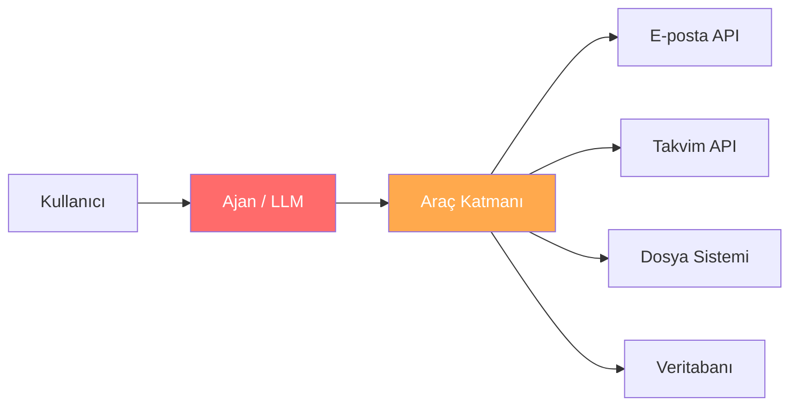
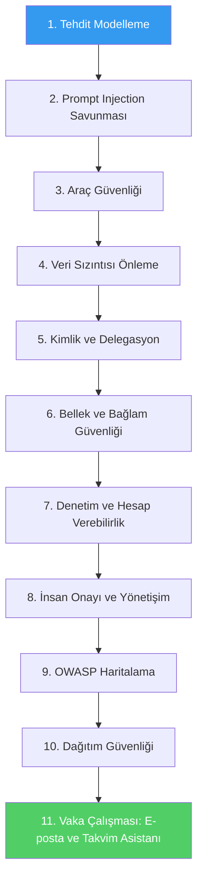
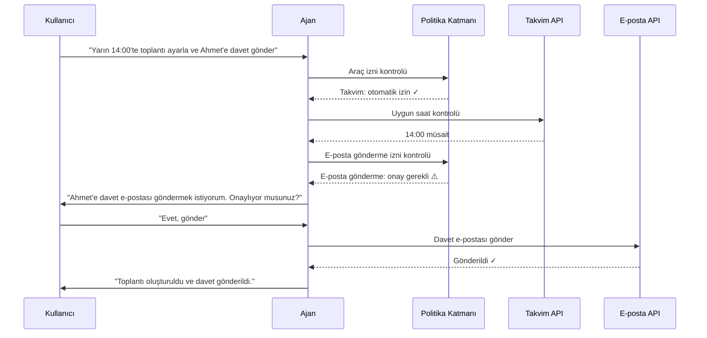

# Secure Agent Systems

**Güvenli, kontrol edilebilir ve hesap verebilir ajanlar tasarlamak için pratik ve üretim odaklı bir eğitim kaynağı.**

> Birçok ekip ajan demosu yapmayı biliyor.
> Ama çok azı o ajanın manipüle edilmesini, aşırı yetkilendirilmesini, veri sızdırmasını veya üretimde hesap veremez hale gelmesini engellemeyi biliyor.

---

## Bu Repo Ne Hakkında?

Bu depo, temel uygulama güvenliğinin ötesinde **güvenli ajantik yapay zeka sistemleri** tasarlamayı öğretir. Odak noktası, araç kullanan ve aksiyon alan ajanların getirdiği gerçek risklerdir:

| Risk Kategorisi | Açıklama |
|---|---|
| **Prompt Injection** | Doğrudan ve dolaylı talimat enjeksiyonu saldırıları |
| **Dolaylı Prompt Manipülasyonu** | Dış içerik üzerinden gömülü kötü niyetli talimatlar |
| **Araç Kötüye Kullanımı** | Araçların yetkisiz veya aşırı kullanımı |
| **Aşırı Yetkilendirme** | Ajana gereğinden fazla yetki verilmesi |
| **Hassas Veri Sızıntısı** | PII, sırlar ve gizli verilerin dışarı sızması |
| **Kimlik ve Yetki İhlali** | Delegasyon ve kimlik doğrulama zayıflıkları |
| **Zehirlenmiş Bellek ve Bağlam** | Kalıcı kötü niyetli talimatların enjeksiyonu |
| **Zayıf Denetlenebilirlik** | Eksik loglama ve iz sürme yeteneği |
| **İnsan Gözetimi Eksikliği** | Yüksek etkili kararların onaysız alınması |

Amaç, ajan sistemlerinin araştırma asistanları, kişisel üretkenlik ajanları, alışveriş asistanları ve araç kullanan copilot'lar gibi farklı alanlarda nasıl **daha güvenli**, **daha kontrol edilebilir** ve **daha hesap verebilir** hale getirilebileceğini göstermektir.

---

## Bu Repo Kimin İçin?

- **AI Mühendisleri** — ajan sistemleri üretime taşıyan geliştiriciler
- **Güvenlik Mimarları** — yapay zeka sistemlerinde güvenlik katmanları tasarlayanlar
- **Platform Mühendisleri** — altyapı ve erişim kontrolü yönetenler
- **Teknik Liderler** — ajan sistemlerinde risk ve yönetişim kararları verenler
- **Araştırmacılar** — ajantik güvenlik alanında çalışanlar

---

## Ajan Güvenliği Neden Farklı?

Geleneksel chatbot'lar yalnızca metin üretir. Ajantik sistemler ise **araçlar çağırır**, **API'ler kullanır**, **dosya yazar**, **e-posta gönderir** ve **takvim yönetir**. Bu fark, güvenlik yüzeyini dramatik biçimde genişletir:



**Temel fark:** Pasif bir chatbot hatalı metin üretirse düzeltilebilir. Ama bir ajan yanlış kişiye e-posta gönderirse, yetkisiz bir toplantı oluşturursa veya gizli bir dosyayı dışarıya aktarırsa — bu geri alınamaz gerçek dünya etkisi yaratır.

---

## Öğrenme Yolu

Bu repo aşağıdaki sırayla okunacak şekilde tasarlanmıştır:



---

## Repo Yapısı

```
secure-agent-systems/
│
├── README.md                          # Bu dosya
├── requirements.txt                   # Python bağımlılıkları
├── Makefile                           # Yardımcı komutlar
├── .gitignore                         # Git ignore kuralları
│
├── docs/                              # Eğitim dokümanları
│   ├── threat-modeling.md             # Tehdit modelleme
│   ├── prompt-injection.md            # Prompt injection savunması
│   ├── tool-security.md               # Araç güvenliği
│   ├── data-exfiltration.md           # Veri sızıntısı önleme
│   ├── identity-and-delegation.md     # Kimlik ve delegasyon
│   ├── memory-poisoning.md            # Bellek ve bağlam zehirlenmesi
│   ├── audit-and-accountability.md    # Denetim ve hesap verebilirlik
│   ├── hitl-governance.md             # İnsan onayı ve yönetişim
│   ├── owasp-mapping.md              # OWASP LLM risk haritalama
│   ├── deployment-security.md         # Dağıtım ve altyapı güvenliği
│   ├── email-calendar-case-study.md   # Vaka çalışması
│   ├── anti-patterns.md               # Anti-pattern'ler
│   └── production-checklist.md        # Üretim kontrol listesi
│
├── examples/                          # Python demo kodları
│   ├── prompt_injection_filter_demo.py
│   ├── structured_output_guard_demo.py
│   ├── tool_permission_guard_demo.py
│   ├── redaction_policy_demo.py
│   ├── approval_flow_demo.py
│   ├── audit_log_demo.py
│   └── delegated_access_demo.py
│
├── diagrams/                          # Mermaid diyagramları
│   ├── secure-agent-architecture.mmd
│   ├── policy-approval-sequence.mmd
│   └── trust-boundaries.mmd
│
└── assets/
    └── images/                        # Görseller
```

---

## Temel Güvenlik Boyutları

### 1. Tehdit Modelleme
Ajantik sistemlerde saldırı yüzeyi, stokastik karar riski, confused deputy (kafası karışık vekil) problemi ve güven sınırı haritalama. → [Detaylı Doküman](docs/threat-modeling.md)

### 2. Prompt Injection Savunması
Doğrudan ve dolaylı prompt injection, talimat/veri ayrımı, delimiter kullanımı, girdi temizleme ve yapılandırılmış çıktı doğrulama. → [Detaylı Doküman](docs/prompt-injection.md)

### 3. Araç Güvenliği ve Aşırı Yetkilendirme
Araç çağırma korumaları, parametre doğrulama, kapsamlı araç izinleri, tehlikeli aksiyon sınıflandırması ve onay gerektiren araç akışları. → [Detaylı Doküman](docs/tool-security.md)

### 4. Veri Sızıntısı Önleme
Giden veri politikaları, sır ve PII maskeleme, çıkış filtreleme, çıktı izleme ve bellek sızıntısı kontrolleri. → [Detaylı Doküman](docs/data-exfiltration.md)

### 5. Kimlik ve Delegasyon
İnsan olmayan kimlikler, yönetilen ajan kimliği, delege edilmiş token'lar, OAuth tabanlı delegasyon, en az yetki erişimi. → [Detaylı Doküman](docs/identity-and-delegation.md)

### 6. Bellek ve Bağlam Güvenliği
Bellek zehirlenmesi, bağlam zehirlenmesi, güvensiz retrieval içeriği, kalıcı kötü niyetli talimatlar. → [Detaylı Doküman](docs/memory-poisoning.md)

### 7. Denetim ve Hesap Verebilirlik
Correlation ID'ler, araç çağırma logları, girdi/çıktı izleri, karar yolları, imzalı loglar. → [Detaylı Doküman](docs/audit-and-accountability.md)

### 8. İnsan Onayı ve Yönetişim
Risk kademelendirme, geri alınabilir ve geri alınamaz aksiyonlar, onay akışları, açıkla-sonra-yap kalıpları. → [Detaylı Doküman](docs/hitl-governance.md)

### 9. OWASP Haritalama
OWASP LLM Top 10 eşleştirmesi, ajan spesifik risk haritalama, risk türüne göre kontrol kataloğu. → [Detaylı Doküman](docs/owasp-mapping.md)

### 10. Dağıtım Güvenliği
Public API vs VPC vs özel dağıtım, sır yönetimi, gateway izolasyonu, ağ sınırları. → [Detaylı Doküman](docs/deployment-security.md)

---

## Vaka Çalışması: E-posta ve Takvim Asistanı

Bu repo, kavramları somut ve anlaşılır kılmak için bir **E-posta ve Takvim Asistanı** senaryosu üzerinden güvenlik kontrollerini gösterir.

**Neden bu senaryo?**
- Herkesin anlayabileceği kadar basit
- Gerçek hayatta araç kullanımı içeriyor
- Güvenlik riskleri doğal olarak ortaya çıkıyor
- Prompt injection, araç kötüye kullanımı, onay akışı ve en az yetki gibi kavramlar net anlatılıyor

**Örnek akış:**



Bu senaryoda gösterilen güvenlik kontrolleri:

| Senaryo | Güvenlik Kontrolü |
|---|---|
| E-postanın içine gömülü kötü niyetli talimat | Prompt injection filtresi |
| Ajanın kullanıcı adına gereğinden fazla işlem yapması | Aşırı yetkilendirme kontrolü |
| Tüm rehbere erişim verilmesi | En az yetki ilkesi |
| Taslak oluşturma vs doğrudan gönderme | Risk kademelendirme |
| Yüksek etkili araçlarda onay gereksinimi | Human-in-the-loop |
| İşlem kaydı | Audit log ve Correlation ID |
| Delege edilmiş erişim | Scoped permission ve delegated token |

→ [Tam Vaka Çalışması](docs/email-calendar-case-study.md)

---

## Anti-Pattern'ler

Ajan sistemlerinde sık yapılan hatalar:

| Anti-Pattern | Risk | Doğru Yaklaşım |
|---|---|---|
| Ajana tüm araçlara erişim vermek | Aşırı yetkilendirme | Araç allowlist ve görev bazlı kapsam |
| Kullanıcı girdisini doğrudan prompt'a koymak | Prompt injection | Talimat/veri ayrımı ve delimiter kullanımı |
| Tüm aksiyonları otomatik çalıştırmak | Geri alınamaz hatalar | Risk kademelendirme ve onay akışı |
| Log tutmamak | Hesap veremezlik | Correlation ID ve karar izi |
| Dış içeriği doğrulamadan kullanmak | Dolaylı injection | İçerik temizleme ve güvenilirlik sınıflandırması |
| Ajan kimliğini paylaşmak | Yetki ihlali | Her ajana ayrı kimlik ve scope |

→ [Tam Anti-Pattern Listesi](docs/anti-patterns.md)

---

## Üretim Kontrol Listesi

Ajan sisteminizi üretime almadan önce doğrulanması gereken kontroller:

- [ ] Araç izinleri en az yetki ilkesine göre yapılandırıldı
- [ ] Prompt injection filtreleri aktif
- [ ] Talimat ve veri arasında net ayrım var
- [ ] Giden veri politikaları tanımlandı
- [ ] PII ve sır maskeleme aktif
- [ ] Yüksek etkili aksiyonlar onay gerektiriyor
- [ ] Tüm araç çağırmaları loglanıyor
- [ ] Correlation ID'ler oluşturuluyor
- [ ] Ajan kimlikleri kapsam dahilinde tanımlı
- [ ] Bellek katmanı güvenlik kontrolünden geçiyor
- [ ] Dağıtım ağ sınırları tanımlı
- [ ] Olay müdahale planı mevcut

→ [Tam Kontrol Listesi](docs/production-checklist.md)

---

## Hızlı Başlangıç

```bash
# Depoyu klonla
git clone https://github.com/<kullanici>/secure-agent-systems.git
cd secure-agent-systems

# Sanal ortam oluştur
python -m venv venv
source venv/bin/activate  # Windows: venv\Scripts\activate

# Bağımlılıkları yükle
pip install -r requirements.txt

# Demo'ları çalıştır
make demo-all

# Belirli bir demo çalıştır
python examples/prompt_injection_filter_demo.py
python examples/approval_flow_demo.py
```

---

## Yol Haritası

- [x] Tehdit modelleme dokümanı
- [x] Prompt injection savunma rehberi
- [x] Araç güvenliği rehberi
- [x] Veri sızıntısı önleme rehberi
- [x] Kimlik ve delegasyon rehberi
- [x] Bellek güvenliği rehberi
- [x] Denetim ve hesap verebilirlik rehberi
- [x] İnsan onayı ve yönetişim rehberi
- [x] OWASP haritalama
- [x] E-posta ve takvim asistanı vaka çalışması
- [x] Python demo kodları
- [x] Mimari diyagramlar
- [ ] Interaktif workshop materyalleri
- [ ] Ek vaka çalışmaları (alışveriş asistanı, araştırma asistanı)
- [ ] Terraform / IaC güvenlik şablonları
- [ ] CI/CD pipeline güvenlik entegrasyonu
- [ ] Benchmark ve test araçları

---

## Katkıda Bulunma

Katkılarınızı bekliyoruz! Katkıda bulunmak için:

1. Bu depoyu fork edin
2. Özellik dalı oluşturun (`git checkout -b feature/yeni-ozellik`)
3. Değişikliklerinizi commit edin (`git commit -m 'Yeni güvenlik kontrolü eklendi'`)
4. Dalınıza push edin (`git push origin feature/yeni-ozellik`)
5. Pull Request açın

Lütfen mevcut yazım stilini ve yapıyı takip edin. Her katkı eğitici, pratik ve üretim odaklı olmalıdır.

---

## Lisans

Bu proje [MIT Lisansı](LICENSE) ile lisanslanmıştır.

---

## İlham Kaynakları ve Referanslar

- [OWASP Top 10 for LLM Applications](https://owasp.org/www-project-top-10-for-large-language-model-applications/)
- [NIST AI Risk Management Framework](https://www.nist.gov/artificial-intelligence)
- [Anthropic Research on AI Safety](https://www.anthropic.com/research)
- [Simon Willison's Prompt Injection Research](https://simonwillison.net/series/prompt-injection/)
- [Google DeepMind Safety Research](https://deepmind.google/safety-research/)

---

<p align="center">
  <i>Güvenlik, sonradan eklenen bir katman değil — mimari bir karardır.</i>
</p>
