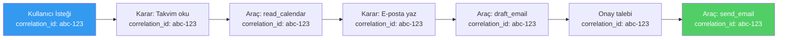
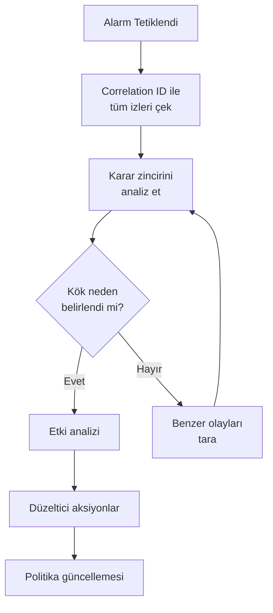

# Denetim, Loglama ve Hesap Verebilirlik

## Genel Bakış

Ajantik sistemlerde **hesap verebilirlik**, bir olay meydana geldiğinde "ne oldu, neden oldu, kim yaptı ve hangi bilgiyle karar verildi" sorularına yanıt verebilme yeteneğidir. Bir ajan otonom kararlar aldığında ve aksiyonlar gerçekleştirdiğinde, bu kararların **izlenebilir**, **tekrarlanabilir** ve **soruşturulabilir** olması zorunludur.

Bu doküman, correlation ID'leri, araç çağırma loglarını, girdi/çıktı izlerini, karar yollarını, imzalı logları ve olay müdahale desteğini kapsar.

---

## Neden Ajan Denetimi Farklı?

Geleneksel uygulama logları, deterministik işlemleri kaydeder: "kullanıcı X, Y sayfasını ziyaret etti." Ajan logları ise çok daha karmaşıktır:

| Geleneksel Log | Ajan Denetim Logu |
|---|---|
| İstek → Yanıt | İstek → Karar → Araç Seçimi → Parametre Üretimi → Onay → Çalıştırma → Sonuç |
| Deterministik | Stokastik — aynı girdi farklı kararlar üretebilir |
| Tek aksiyon | Zincirleme aksiyonlar — bir karar sonraki kararları etkiler |
| Kullanıcı başlattı | Ajan otonom başlatabilir |
| Basit girdi/çıktı | Bağlam, bellek, retrieval, araçlar ve politikalar etkiler |

---

## Correlation ID ve İz Sürme

Her ajan etkileşimi, baştan sona izlenebilir olmalıdır. **Correlation ID**, bir kullanıcı isteğinden başlayarak tüm araç çağrıları, kararlar ve aksiyonları birbirine bağlayan benzersiz tanımlayıcıdır.



### Uygulama

```python
import uuid
import json
import hashlib
from datetime import datetime
from dataclasses import dataclass, field, asdict
from typing import Optional, Any
from enum import Enum


class EventType(str, Enum):
    REQUEST = "request"
    DECISION = "decision"
    TOOL_CALL = "tool_call"
    TOOL_RESULT = "tool_result"
    APPROVAL_REQUEST = "approval_request"
    APPROVAL_RESPONSE = "approval_response"
    POLICY_CHECK = "policy_check"
    ERROR = "error"
    RESPONSE = "response"


@dataclass
class AuditEvent:
    """Denetim izi olayı."""
    event_id: str
    correlation_id: str
    timestamp: str
    event_type: EventType
    agent_id: str
    user_id: str
    data: dict
    parent_event_id: Optional[str] = None
    hash: Optional[str] = None

    def compute_hash(self, previous_hash: str = "") -> str:
        """Olay bütünlüğü için zincirlenmiş hash hesaplar."""
        content = json.dumps({
            "event_id": self.event_id,
            "correlation_id": self.correlation_id,
            "timestamp": self.timestamp,
            "event_type": self.event_type.value,
            "data": self.data,
            "previous_hash": previous_hash,
        }, sort_keys=True)
        self.hash = hashlib.sha256(content.encode()).hexdigest()
        return self.hash


class AuditLogger:
    """Yapılandırılmış denetim log sistemi."""

    def __init__(self, agent_id: str):
        self.agent_id = agent_id
        self.events: list[AuditEvent] = []
        self.last_hash: str = ""

    def _create_event(
        self,
        correlation_id: str,
        event_type: EventType,
        user_id: str,
        data: dict,
        parent_event_id: Optional[str] = None,
    ) -> AuditEvent:
        event = AuditEvent(
            event_id=str(uuid.uuid4()),
            correlation_id=correlation_id,
            timestamp=datetime.utcnow().isoformat(),
            event_type=event_type,
            agent_id=self.agent_id,
            user_id=user_id,
            data=data,
            parent_event_id=parent_event_id,
        )
        self.last_hash = event.compute_hash(self.last_hash)
        self.events.append(event)
        return event

    def log_request(self, correlation_id: str, user_id: str, request: str) -> AuditEvent:
        return self._create_event(
            correlation_id=correlation_id,
            event_type=EventType.REQUEST,
            user_id=user_id,
            data={"request": request},
        )

    def log_decision(
        self,
        correlation_id: str,
        user_id: str,
        decision: str,
        reasoning: str,
        parent_event_id: str,
    ) -> AuditEvent:
        return self._create_event(
            correlation_id=correlation_id,
            event_type=EventType.DECISION,
            user_id=user_id,
            data={"decision": decision, "reasoning": reasoning},
            parent_event_id=parent_event_id,
        )

    def log_tool_call(
        self,
        correlation_id: str,
        user_id: str,
        tool_name: str,
        parameters: dict,
        parent_event_id: str,
    ) -> AuditEvent:
        return self._create_event(
            correlation_id=correlation_id,
            event_type=EventType.TOOL_CALL,
            user_id=user_id,
            data={"tool": tool_name, "parameters": parameters},
            parent_event_id=parent_event_id,
        )

    def log_tool_result(
        self,
        correlation_id: str,
        user_id: str,
        tool_name: str,
        result: dict,
        success: bool,
        parent_event_id: str,
    ) -> AuditEvent:
        return self._create_event(
            correlation_id=correlation_id,
            event_type=EventType.TOOL_RESULT,
            user_id=user_id,
            data={"tool": tool_name, "result": result, "success": success},
            parent_event_id=parent_event_id,
        )

    def log_policy_check(
        self,
        correlation_id: str,
        user_id: str,
        policy: str,
        result: str,
        parent_event_id: str,
    ) -> AuditEvent:
        return self._create_event(
            correlation_id=correlation_id,
            event_type=EventType.POLICY_CHECK,
            user_id=user_id,
            data={"policy": policy, "result": result},
            parent_event_id=parent_event_id,
        )

    def get_trace(self, correlation_id: str) -> list[dict]:
        """Bir correlation ID'ye ait tüm olayları kronolojik sırada döndürür."""
        trace = [
            asdict(e) for e in self.events
            if e.correlation_id == correlation_id
        ]
        return sorted(trace, key=lambda x: x["timestamp"])

    def verify_integrity(self) -> dict:
        """Log zincirinin bütünlüğünü doğrular."""
        if not self.events:
            return {"valid": True, "checked": 0}

        previous_hash = ""
        for i, event in enumerate(self.events):
            expected_hash = event.compute_hash(previous_hash)
            if event.hash != expected_hash:
                return {
                    "valid": False,
                    "broken_at": i,
                    "event_id": event.event_id,
                }
            previous_hash = event.hash

        return {"valid": True, "checked": len(self.events)}
```

---

## Karar İzi (Decision Trail)

Ajan kararlarının **neden** alındığını kaydetmek, denetim ve hata ayıklama için kritiktir:

### Ne Loglanmalı?

| Bilgi | Neden Önemli? |
|---|---|
| **Kullanıcı isteği** | Kararın kökeni |
| **Bağlam** | Karar anındaki bilgi durumu |
| **Araç seçimi gerekçesi** | Neden bu araç seçildi |
| **Parametre üretimi** | Parametreler nereden geldi |
| **Politika kontrolü** | Hangi politikalar uygulandı |
| **Onay durumu** | Onay istendi mi, verildi mi |
| **Sonuç** | Aksiyon başarılı mı oldu |

### Örnek Karar İzi

```json
{
  "correlation_id": "abc-123",
  "trace": [
    {
      "timestamp": "2026-03-14T10:00:00Z",
      "type": "request",
      "data": {"request": "Yarın 14:00'te Ahmet ile toplantı ayarla"}
    },
    {
      "timestamp": "2026-03-14T10:00:01Z",
      "type": "decision",
      "data": {
        "decision": "Takvimi kontrol et",
        "reasoning": "Uygun saat olup olmadığını doğrulamak gerekiyor"
      }
    },
    {
      "timestamp": "2026-03-14T10:00:02Z",
      "type": "tool_call",
      "data": {"tool": "read_calendar", "parameters": {"date": "2026-03-15"}}
    },
    {
      "timestamp": "2026-03-14T10:00:03Z",
      "type": "policy_check",
      "data": {"policy": "calendar_write", "result": "allowed"}
    },
    {
      "timestamp": "2026-03-14T10:00:04Z",
      "type": "tool_call",
      "data": {
        "tool": "create_event",
        "parameters": {
          "date": "2026-03-15",
          "time": "14:00",
          "title": "Ahmet ile Toplantı"
        }
      }
    },
    {
      "timestamp": "2026-03-14T10:00:05Z",
      "type": "approval_request",
      "data": {"action": "send_email", "target": "ahmet@sirket.com"}
    }
  ]
}
```

---

## İmzalı ve Doğrulanabilir Loglar

Log bütünlüğünü sağlamak için **zincirlenmiş hash** kullanılır. Her log girişi, önceki girişin hash'ini içerir — bu, herhangi bir girişin değiştirilmesini tespit edilebilir kılar:

```
Event 1: hash = SHA256(data_1 + "")           → h1
Event 2: hash = SHA256(data_2 + h1)           → h2
Event 3: hash = SHA256(data_3 + h2)           → h3
...
```

Herhangi bir olay değiştirilirse, sonraki tüm hash'ler geçersiz olur. Bu, log manipülasyonunu tespit etmeyi mümkün kılar.

---

## Olay Müdahale Desteği

Bir güvenlik olayı meydana geldiğinde, denetim logları soruşturmayı desteklemelidir:

### Soruşturma Soruları ve Log Kaynakları

| Soru | Log Kaynağı |
|---|---|
| Olay ne zaman başladı? | Correlation ID ve zaman damgası |
| Hangi kullanıcı etkilendi? | User ID |
| Hangi araçlar çağırıldı? | Tool call logları |
| Hangi veriler aktarıldı? | Girdi/çıktı izleri |
| Hangi politikalar atlandı? | Policy check logları |
| Onay verildi mi? | Approval logları |
| Benzer olaylar var mı? | Kalıp analizi |

### Soruşturma Akışı



---

## Loglama En İyi Uygulamaları

| Uygulama | Açıklama |
|---|---|
| **Her şeyi logla** | Her araç çağrısı, karar ve politika kontrolü |
| **Yapılandırılmış format** | JSON formatında, makine tarafından okunabilir |
| **Correlation ID** | Her isteği baştan sona izlenebilir kıl |
| **Zaman damgası** | UTC formatında, milisaniye hassasiyetinde |
| **Değiştirilemezlik** | Loglar append-only, zincirlenmiş hash ile |
| **Saklama politikası** | Düzenleyici gereksinimlere uygun saklama süresi |
| **Hassas veri maskeleme** | Loglarda PII ve sırlar maskelenmeli |
| **Gerçek zamanlı izleme** | Anomali tespiti için akış bazlı izleme |

---

## İlgili Demo

→ [Denetim Logu Demo](../examples/audit_log_demo.py)

## Sonraki Adımlar

- [İnsan Onayı ve Yönetişim](hitl-governance.md) — Onay akışları
- [OWASP Haritalama](owasp-mapping.md) — Risk haritalama
