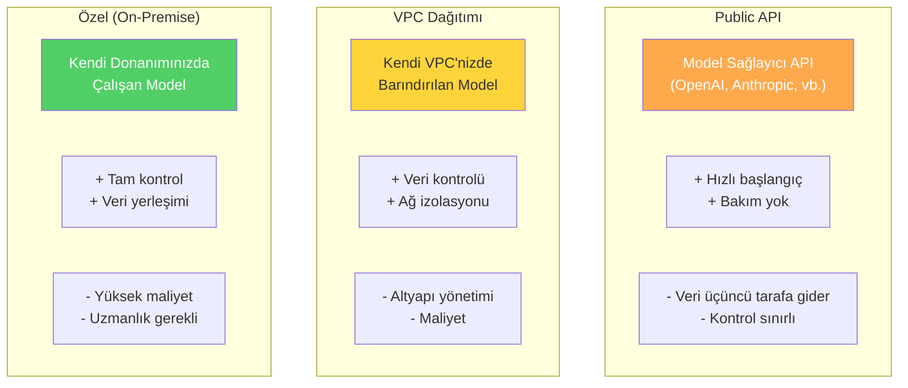
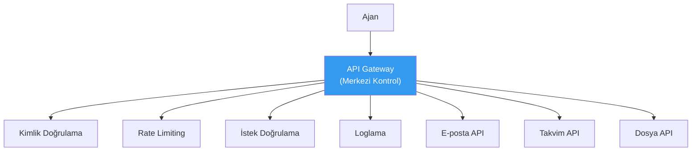
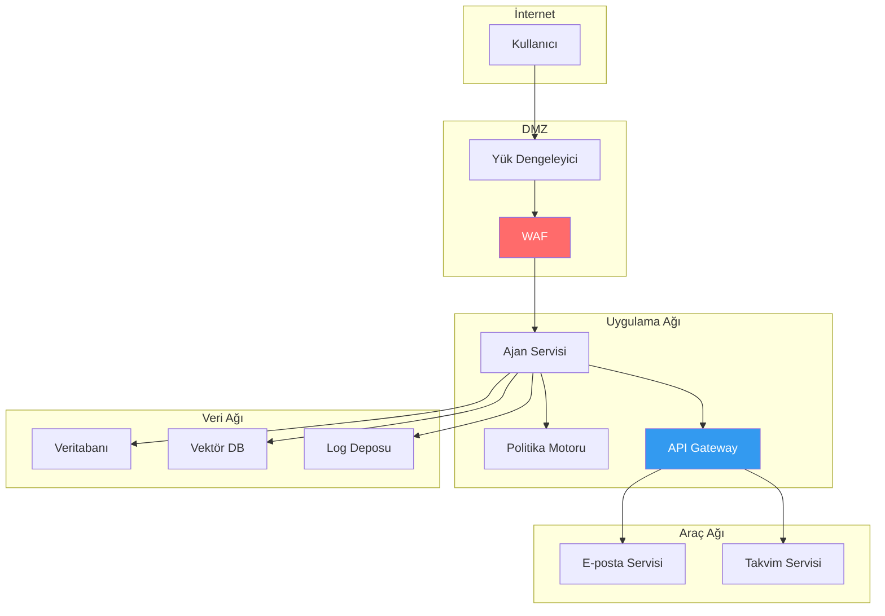

# Dağıtım ve Altyapı Güvenliği

## Genel Bakış

Ajan güvenliği yalnızca uygulama katmanında değil, **altyapı katmanında** da sağlanmalıdır. Model seçimi, dağıtım modeli, ağ topolojisi, sır yönetimi ve araç çalıştırma ortamı — bunların her biri güvenlik duruşunu doğrudan etkiler.

Bu doküman, dağıtım seçeneklerini güvenlik perspektifinden değerlendirir ve güvenli altyapı tasarımı için rehberlik sunar.

---

## Dağıtım Modelleri

### Karşılaştırma



| Kriter | Public API | VPC | Özel (On-Premise) |
|---|---|---|---|
| **Veri kontrolü** | Düşük | Yüksek | Tam |
| **Ağ izolasyonu** | Yok | Var | Tam |
| **Başlangıç maliyeti** | Düşük | Orta | Yüksek |
| **İşletme maliyeti** | Kullanıma göre | Sabit + kullanım | Sabit |
| **Uyumluluk** | Sınırlı | İyi | Tam |
| **Gecikme** | Değişken | Düşük | En düşük |
| **Model çeşitliliği** | Geniş | Sınırlı | Çok sınırlı |
| **Güvenlik kontrolü** | API düzeyinde | Ağ + API | Tam |

### Seçim Kriterleri

- **Public API uygundur:** PoC, düşük hassasiyetli veriler, hızlı prototipleme
- **VPC gereklidir:** Kurumsal veriler, düzenleyici gereksinimler, orta-yüksek hassasiyet
- **Özel dağıtım gereklidir:** Kamu/savunma, yüksek düzenleyici baskı, tam veri yerleşimi

---

## Sır Yönetimi (Secret Management)

Ajan sistemlerinde yönetilmesi gereken sırlar:

| Sır Türü | Örnek | Risk |
|---|---|---|
| API anahtarları | OpenAI API key, Google Calendar API key | Yetkisiz API kullanımı |
| OAuth token'ları | Kullanıcı delegasyon token'ları | Kimlik taklidi |
| Veritabanı kimlik bilgileri | DB bağlantı stringleri | Veri ihlali |
| Şifreleme anahtarları | Log şifreleme anahtarları | Denetim izi manipülasyonu |
| Webhook sırları | Bildirim servisi token'ları | Bildirim manipülasyonu |

### Güvenli Sır Yönetimi İlkeleri

```python
from dataclasses import dataclass
from enum import Enum
from typing import Optional
import os


class SecretSource(str, Enum):
    ENV_VAR = "environment_variable"
    VAULT = "vault"
    KMS = "kms"
    HARDCODED = "hardcoded"  # ASLA kullanmayın


@dataclass
class SecretConfig:
    """Sır yapılandırma tanımı."""
    name: str
    source: SecretSource
    rotation_days: int
    access_scope: list[str]


class SecretManager:
    """Güvenli sır erişim katmanı."""

    def __init__(self):
        self._cache: dict[str, str] = {}

    def get_secret(self, config: SecretConfig) -> Optional[str]:
        if config.source == SecretSource.HARDCODED:
            raise SecurityError(
                "Hardcoded sırlar güvenlik ihlalidir. "
                "Ortam değişkeni veya vault kullanın."
            )

        if config.source == SecretSource.ENV_VAR:
            value = os.environ.get(config.name)
            if not value:
                raise ValueError(f"Ortam değişkeni bulunamadı: {config.name}")
            return value

        if config.source == SecretSource.VAULT:
            return self._fetch_from_vault(config.name)

        return None

    def _fetch_from_vault(self, name: str) -> str:
        # Gerçek uygulamada HashiCorp Vault, AWS Secrets Manager vb.
        raise NotImplementedError("Vault entegrasyonu yapılandırılmalı")


class SecurityError(Exception):
    pass


# Doğru sır yapılandırması
SECRETS = {
    "openai_api_key": SecretConfig(
        name="OPENAI_API_KEY",
        source=SecretSource.ENV_VAR,
        rotation_days=90,
        access_scope=["agent_service"],
    ),
    "calendar_oauth_secret": SecretConfig(
        name="CALENDAR_OAUTH_SECRET",
        source=SecretSource.VAULT,
        rotation_days=30,
        access_scope=["calendar_tool"],
    ),
}
```

### Anti-Pattern'ler

```python
# ❌ YANLIŞ: Kod içinde sır
API_KEY = "sk-abc123..."

# ❌ YANLIŞ: Versiyon kontrolüne .env dosyası
# .env dosyası .gitignore'da olmalı

# ❌ YANLIŞ: Loglarda sır
print(f"API çağrısı yapılıyor: key={api_key}")

# ✅ DOĞRU: Ortam değişkeni
api_key = os.environ.get("OPENAI_API_KEY")

# ✅ DOĞRU: Maskelenmiş log
print(f"API çağrısı yapılıyor: key=***{api_key[-4:]}")
```

---

## Gateway İzolasyonu

Ajan ile araçlar arasına bir **API gateway** katmanı yerleştirin:



### Gateway Sorumlulukları

| Sorumluluk | Açıklama |
|---|---|
| **Kimlik doğrulama** | Her araç çağrısının yetkili bir ajan tarafından yapıldığını doğrulama |
| **Yetkilendirme** | Token scope'unun istenen aksiyona uygunluğunu kontrol |
| **Rate limiting** | Araç başına çağrı sayısını sınırlama |
| **İstek doğrulama** | Parametre şemasına uygunluk kontrolü |
| **Yanıt filtreleme** | Araç yanıtından hassas veri maskeleme |
| **Loglama** | Tüm isteklerin yapılandırılmış loglanması |
| **Devre kesici** | Hatalı araçların otomatik devre dışı bırakılması |

---

## Ağ Sınırları

### Segmentasyon



### İlkeler

| İlke | Açıklama |
|---|---|
| **Mikro segmentasyon** | Her bileşen kendi ağ segmentinde |
| **Varsayılan reddet** | Açıkça izin verilmeyen trafik engellenmiş |
| **East-west filtreleme** | İç ağda da güvenlik duvarı kuralları |
| **Egress kontrolü** | Dış ağa çıkan trafik kısıtlı ve izlenen |
| **mTLS** | Servisler arası şifreli ve kimlik doğrulamalı iletişim |

---

## Güvenli Araç Çalıştırma Ortamları

Araçlar, ajanın kendisinden **izole** ortamlarda çalıştırılmalıdır:

### İzolasyon Seviyeleri

| Seviye | Yöntem | Güvenlik | Performans |
|---|---|---|---|
| **Süreç izolasyonu** | Ayrı OS süreci | Düşük | Yüksek |
| **Container izolasyonu** | Docker/Podman | Orta | Orta-Yüksek |
| **VM izolasyonu** | Hafif VM (Firecracker) | Yüksek | Orta |
| **Sandbox** | gVisor, Wasm | Yüksek | Orta-Yüksek |

### Neden Önemli?

Bir araç (örneğin web scraper) uzak bir sunucudan kod indirirse ve bu kod ajan sürecinde çalışırsa, tüm ajan ortamına erişim kazanabilir. İzole ortamda çalıştırma, bu riski sınırlar.

---

## Dağıtım Kontrol Listesi

- [ ] Model API anahtarları güvenli bir vault'ta saklanıyor
- [ ] Ağ segmentasyonu uygulanmış
- [ ] API gateway tüm araç çağrılarını yönetiyor
- [ ] Rate limiting yapılandırılmış
- [ ] mTLS servisler arası iletişimde aktif
- [ ] Egress trafiği kısıtlı ve izleniyor
- [ ] Araçlar izole ortamlarda çalıştırılıyor
- [ ] Log deposu değiştirilemez (immutable)
- [ ] Sır rotasyonu otomatikleştirilmiş
- [ ] Olağanüstü durum kurtarma planı mevcut

---

## Sonraki Adımlar

- [Vaka Çalışması](email-calendar-case-study.md) — E-posta ve takvim asistanı
- [Anti-Pattern'ler](anti-patterns.md) — Yaygın hatalar
